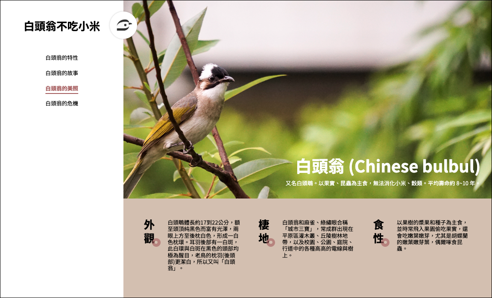

# 🐦 Orii Demo - 白頭翁不吃小米

一個展示台灣常見鳥類「白頭翁」相關資訊的響應式網站 Demo，結合現代前端技術與優秀的使用者體驗設計。

## 🌐 線上展示

**DEMO**: https://yo0guitarit.github.io/orii-demo/part1/index.html

## 📱 響應式設計展示

### 桌面版



### 手機版


## ✨ 專案特色

### 🎨 視覺設計

- **現代網格佈局**: 使用 CSS Grid 實現響應式佈局
- **統一設計系統**: CSS 變數管理色彩與字體系統
- **品牌視覺**: 自製白頭翁 logo 與 favicon
- **無障礙設計**: 符合 WCAG 2.1 標準的可訪問性

### 🛠️ 技術實作

- **語意化 HTML5**: 使用正確的語意標籤提升 SEO
- **原生 JavaScript**: 無框架依賴的互動功能
- **響應式設計**: 支援桌面、平板、手機多種裝置
- **效能優化**: 輕量化設計，快速載入

### 🎯 功能特點

- **互動式導航**: 可收合的手機版選單
- **平滑滾動**: 優雅的頁面內導航體驗
- **狀態管理**: 導航項目的 active 狀態切換
- **鍵盤友善**: 完整的鍵盤導航支援

## 🏗️ 專案結構

```
orii-demo/
├── part1/                    # 主要網站內容
│   ├── assets/              # 靜態資源
│   │   ├── bird-logo.png    # 白頭翁 logo
│   │   ├── menu-icon.svg    # 選單圖示
│   │   ├── web-view.png     # 桌面版截圖
│   │   └── phone-view.png   # 手機版截圖
│   ├── index.html           # 主頁面
│   ├── styles.css           # 樣式表
│   └── script.js            # 互動邏輯
├── part2/                   # 問答題目錄
│   ├── answer01.js          # JavaScript 實作題
│   ├── answer02.md          # Arrow Function 說明
│   ├── answer03.md          # 前端技術問答
│   └── ...                 # 其他問答檔案
└── README.md               # 專案說明文件
```

## 🛠️ 技術棧

| 類別     | 技術               | 說明                                   |
| -------- | ------------------ | -------------------------------------- |
| **結構** | HTML5              | 語意化標籤、無障礙屬性                 |
| **樣式** | CSS3               | Grid Layout、CSS Variables、響應式設計 |
| **互動** | Vanilla JavaScript | ES6+、事件處理、DOM 操作               |
| **字體** | Google Fonts       | Noto Sans TC 中文字體                  |
| **版控** | Git                | 分支管理、Pull Request 流程            |

## 🎨 設計系統

### 色彩配置

```css
:root {
  --color-white: #ffffff; /* 主要背景色 */
  --color-brown: #aa6666; /* 主要品牌色 */
  --color-black: #000000; /* 主要文字色 */
  --color-beige: #d7c7b8; /* 背景輔助色 */
  --color-gray: #f0f0f0; /* 輔助背景色 */
}
```

### 響應式斷點

- **桌面版**: > 768px（完整側邊欄佈局）
- **平板版**: 500px - 768px（適配中等螢幕）
- **手機版**: < 500px（收合式導航選單）

## 📋 開發流程

### Git 分支管理

- `main`: 穩定版本分支
- `develop`: 開發整合分支
- `feature/*`: 功能開發分支

### 主要開發階段

1. **基礎架構** - HTML 結構與基本樣式
2. **側邊欄實作** - 導航功能與樣式設計
3. **Hero 區域** - 主要內容展示區
4. **響應式優化** - 多裝置適配
5. **互動功能** - JavaScript 邏輯實作
6. **無障礙改善** - 可訪問性優化

## 🔄 版本歷史

| 版本 | 功能       | 說明                           |
| ---- | ---------- | ------------------------------ |
| v1.0 | 完整網站   | 響應式設計、互動功能、品牌元素 |
| v0.8 | 品牌優化   | 新增 favicon、logo 設計        |
| v0.6 | 導航系統   | 手機版選單、互動邏輯           |
| v0.4 | 響應式佈局 | CSS Grid、媒體查詢             |
| v0.2 | 基礎架構   | HTML 結構、基本樣式            |

## 💡 技術亮點

### 1. 現代 CSS 技術

- **CSS Grid Layout**: 複雜佈局的現代解決方案
- **CSS Variables**: 設計 token 統一管理
- **Flexbox**: 靈活的元件排版

### 2. 無障礙設計

- **語意化標籤**: 正確使用 `<header>`, `<nav>`, `<main>`, `<article>`
- **ARIA 屬性**: `aria-label`, `aria-expanded`, `role` 等
- **鍵盤導航**: Tab 鍵序列、Enter/Space 支援

### 3. 效能優化

- **字體預載入**: Google Fonts preconnect
- **圖片優化**: SVG 圖示、壓縮 PNG
- **程式碼分離**: HTML/CSS/JS 職責分明

## 🎯 學習重點

1. **Git 版本控制**: 分支管理、Pull Request 流程
2. **HTML 語意化**: 正確標籤使用、SEO 友善
3. **CSS 預處理**: 變數系統、模組化思維
4. **響應式設計**: Mobile-first、漸進增強
5. **無障礙網頁**: WCAG 標準、可訪問性測試

## 📝 專案說明

> ⚠️ **設計說明**: 本次設計稿中 logo 為手繪鳥圖案，題目要求以純 CSS 製作。
> 我優先將版面與互動細節忠實還原，確保語意化與響應式、可及性，並預留 logo 欄位於 header。
> CSS 圖形設計目前非我主要專長，若進入團隊後有需求，願意進一步學習與補齊。

本專案展示了完整的前端開發技能，從設計系統建立到互動功能實作，
體現了對現代網頁開發最佳實踐的理解與應用。

---

## 📚 問答紀錄

### Part 2: 技術問答與實作

以下問答展示了對前端開發各個面向的理解與經驗：

#### 🔧 JavaScript 核心概念

- **[Q1: 機場資料查詢](./part2/answer01.js)** - JavaScript 陣列操作與資料處理
- **[Q2: Arrow Function](./part2/answer02.md)** - ES6 語法與 `this` 綁定機制
- **[Q4: Async/Await](./part2/answer04.md)** - 非同步程式設計與 Promise 處理
- **[Q5: Closure 閉包](./part2/answer05.md)** - JavaScript 作用域與實際應用

#### 🎨 前端效能與渲染

- **[Q7: Browser Rendering](./part2/answer07.md)** - 瀏覽器渲染流程與效能優化
- **[Q3: 前端技術問答](./part2/answer03.md)** - 前端開發相關技術討論

#### 🛠️ 開發工具與框架

- **[Q10: 版本控制系統](./part2/answer10.md)** - Git 使用經驗與團隊協作
- **[Q11: Web Framework](./part2/answer11.md)** - 框架使用經驗與開發思維

#### 💭 其他問答

- **[Q6-Q9: 綜合問答](./part2/)** - 其他技術相關問題
- **[Q12-Q13: 心得回饋](./part2/)** - 學習心得與試題反饋

